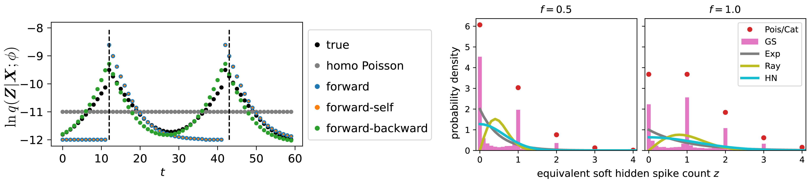

# A Differentiable Partially Observable Generalized Linear Model with Forward-Backward Message Passing [ICML 2024]

<div align='center' >Chengrui Li, Yule Wang, Weihan Li, and Anqi Wu</div>

[[paper]](https://openreview.net/pdf?id=2FKzbEE24s) [[arXiv]](https://arxiv.org/abs/2402.01263) [[slides]](https://jerrysoybean.github.io/assets/pdf/diffPOGLM%20pre.pdf) [[video]]() [[poster]](https://jerrysoybean.github.io/assets/pdf/diffPOGLM%20ICML%202024%20poster.pdf) [[文章]](https://jerrysoybean.github.io/assets/pdf/softPOGLM_ICML_2024_%E4%B8%AD%E6%96%87.pdf)



## 1 Installation
From the current directory (which includes this `README.md`), run
```
cd poglm
pip install -e .
```

## 2 Tutorial
`demo.ipynb` is a step-by-step tutorial that learn a POGLM using a specific choice of method combination from a generated synthetic dataset.
